# **Introduction**

---
One of the most fascinating datasets that I've come across is the Ames Housing dataset. It was originally collated by Dr. Dean De Cock (Truman State Univ) for the undergraduate statistical methods course, and later became very popular through Kaggle.

For about 3000 houses sold in Ames City (Iowa, US) between 2006 and 2010, are given the following info: 
 * Location of the House
 * House Size and Area Measurements
 * Furnishing of the House
 * Subjective Evaluations of House
 * Immediate Context of Sale

Our objective is to predict and explain the Sale Price of the house based on its location, size, furnishing, quality, context etc.

References:
 * Author's Introduction: https://tinyurl.com/ycfc58y8
 * Data Dictionary: http://jse.amstat.org/v19n3/decock/DataDocumentation.txt
 * Data in Excel: https://tinyurl.com/ycbbw3h7
---


```
PATH = '/content/drive/My Drive/Projects/Machine Learning/Real World Problems/Housing Prices/AmesHousing.xls'
import pandas as pd
df = pd.read_excel(PATH)
df.columns = [i.replace(' ', '') for i in df.columns]
print(df[['PID', 'SalePrice', 'Neighborhood', 'GrLivArea', 'YrSold', 'MoSold']].sample(frac = 1).head(10))
```

                PID  SalePrice Neighborhood  GrLivArea  YrSold  MoSold
    48    528180070     319900      NridgHt       1752    2010       2
    2408  528186110     310090      NridgHt       1666    2006       6
    1026  527357110     146900       NWAmes       1308    2008       6
    1762  528326060     248000      NoRidge       2285    2007       6
    2628  535456020     141000        NAmes       1150    2006       5
    1473  907405140     208500      CollgCr       1710    2008       2
    2061  905106150     129000       Sawyer        894    2007       5
    1146  531450170     187000      SawyerW       1710    2008       6
    61    528358010     260400      NoRidge       1720    2010       3
    979   923228230      88000      MeadowV       1092    2009       8


# **Variable of Interest: Sale Price**

Two observations: 
1. A majority of houses are sold for less, a minority of houses are sold for a really, really high amount. Sale Price exhibits high left skew, and thus needs to be log-transformed. Once done, it appearly nearly normal.
2. Post log-transformation, we remove outliers outside μ ± 3σ. These examples were aberrations that could mislead. 


```
import seaborn as sns
sns.set_style("darkgrid")
import matplotlib.pyplot as plt
plt.rcParams["figure.figsize"] = (10,5)

sns.distplot(df.SalePrice, hist=True, kde = False)
plt.title('Distribution of Sale Price')
plt.show()
```


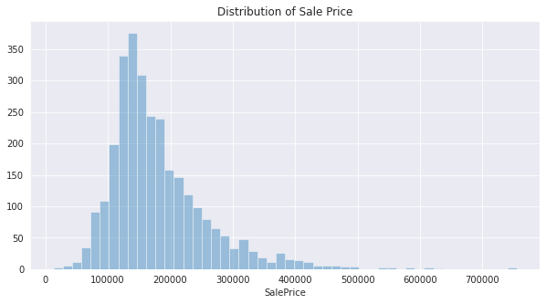


```
df['logSalePrice'] = np.log(df.SalePrice)
sns.distplot(df.logSalePrice, hist=True, kde = False)
plt.title('Distribution of Log Sale Price')

# Outlier Thresholds
μ = df.logSalePrice.mean()
σ = df.logSalePrice.std()
plt.axvline(μ - 3 * σ, color='black', linestyle = '--')
plt.axvline(μ + 3 * σ, color='black', linestyle = '--')

plt.show()
```


* We remove outliers below and above these statistical thresholds. 
* Additionally, by the recommendation of the author we remove houses with "GrLivArea" greater than 4000. 


```
old_examples = df.shape[0]
df = df[(df.logSalePrice > μ - 3 * σ) &
        (df.logSalePrice < μ + 3 * σ) & 
        (df.GrLivArea < 4000)]
new_examples = df.shape[0]
print(old_examples, new_examples)
```

    2930 2907


* A total of 23 records are dropped, and we are left with 2907 records. 


```
sns.distplot(df.logSalePrice, hist=True, kde = False)
plt.title('Cleaned-Up Log Sale Price')
μ = df.logSalePrice.mean()
σ = df.logSalePrice.std()
plt.axvline(μ - 3 * σ, color='black', linestyle = '--')
plt.axvline(μ + 3 * σ, color='black', linestyle = '--')
plt.show()
```


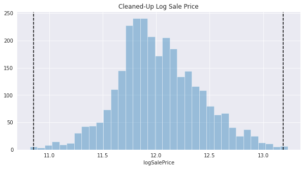


# **Factors behind Log Sale Price**

* **Location of the House:** Ordinal attributes telling us the Neighborhood, Postal ID, Zoning allocation.
* **Size of the House:** Continous attributes which capture Sq Feet Area of the Lot, Living Space, Basement, etc.
* **Contents of the House:** Mainly count vectors telling us the no. of rooms, furnished items, etc.
* **Subjective Evaluations:** Subjective Evaluations such as 'Overall Quality' of different aspects.  
* **Immediate Context of Sale:** The time of year, the mode of payment and relation between seller & buyer.
* **Variations in Demand:** As proxied by no. of sales conducted before, in the neighborhood. 


Helper Function 1 - CatPlot
 * Plots LogSalePrice across Categories, ordered.


```
def CatPlot(var):
    my_order = df[['logSalePrice', var]].groupby(by=var).mean().sort_values('logSalePrice').index
    chart = sns.violinplot(x=var, y='logSalePrice', data=df, order=my_order)
    chart.axhline(y = df.logSalePrice.mean(), color='black', linewidth=2) 
    chart.set_xticklabels(chart.get_xticklabels(), rotation=45, horizontalalignment='right',fontweight='light',fontsize='x-large')
    plt.title(f'Distribution of logSalePrice with {var}')
    plt.show()
```

Helper Function 2 - Neural Net Regression
* NNReg = Neural Net Regression between LogSalePrice and Selected Variables.
* Numericals get standardized and Categoricals get dummified. 


```
from sklearn.neural_network import MLPRegressor
from sklearn.linear_model import LinearRegression, Ridge, Lasso
from sklearn.model_selection import train_test_split
from sklearn.metrics import r2_score
from warnings import filterwarnings
filterwarnings('ignore')
def NNReg(var, alpha = 2, yhat_and_y = False):
    y = df.logSalePrice
    x = df[var].copy()
    for i in x.select_dtypes(exclude = 'object'):
        ε = 0.0000001
        x[i] = (x[i]-x[i].mean(axis = 0)+ε)/(x[i].std(axis = 0)+ε)
    for i in x.select_dtypes(include = 'object').columns:
        x = pd.concat([x, pd.get_dummies(x[i])], axis = 1)
        x = x.drop(i, axis = 1)
    x_train, x_val, y_train, y_val = train_test_split(x, y, test_size = 0.3, random_state = 42)

    N_h1, N_h2 = round(x_train.shape[1] * 1.5), round(x_train.shape[1] * 0.5)
    model = MLPRegressor(hidden_layer_sizes = (N_h1, N_h2), alpha = alpha, max_iter = 500, random_state = 42, verbose = False)
    model.fit(x_train, y_train)
    yhat = model.predict(x_train)
    print(f'Train: {r2_score(y_train, yhat):0.3f}')
    print(f'Test: {r2_score(y_val, model.predict(x_val)):0.3f}')

    if yhat_and_y == True: 
        plt.figure(figsize=(16, 6))
        plt.plot(y_val, y_val, c = 'black', linestyle = '--', label = 'Perfect Prediction')
        plt.scatter(model.predict(x_val), y_val, marker='.', label = 'Current Prediction')
        plt.title('Regression Model for logSalePrice')
        plt.ylabel('True Values')
        plt.xlabel('Predictions')
        plt.legend()
        plt.show()
    
    return model
```

# **Variation of Sale Price by Location** 


* Sale Price varies a lot by Neighborhood. 
* The following is a map of Ames' Neighborhoods 


```
PATH = '/content/drive/My Drive/Projects/Machine Learning/Real World Problems/Housing Prices/house-prices-advanced-regression-techniques/nbor.png'
from PIL import Image  
Image.open(PATH)
```


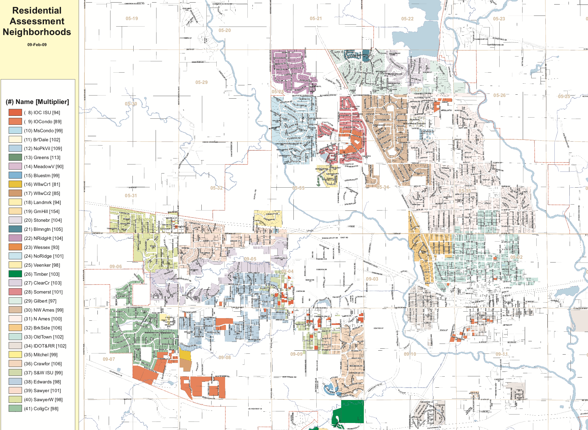


```
plt.rcParams["figure.figsize"] = (15,3)
CatPlot('Neighborhood')
```


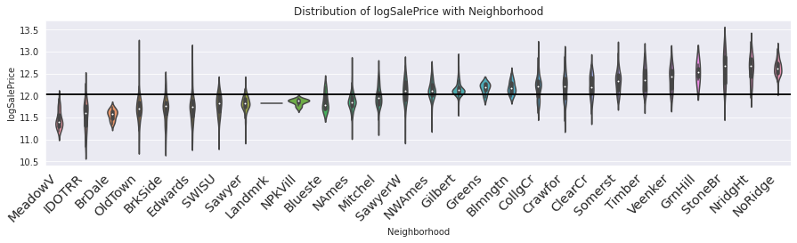


* Sale Price is higher in Residential zones (more so in low density 'L') and floating villages (FV) and lower in Agricultural/Industrial zones


```
CatPlot('MSZoning')
```


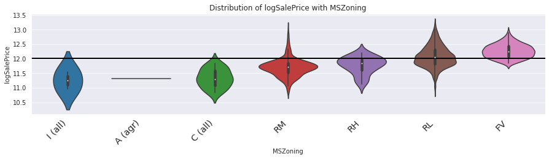


* The Parcel Number can be used to pin down the exact location of the house. 


```
df.PID = df.PID.astype(str) # Parcel Identification
df['PID1']=df.PID.str[0:1] # township
df['PID2']=df.PID.str[1:3] # section number
df['PID3']=df.PID.str[3:6] # quarter section (N, E, S, W, etc)
df['PID4']=df.PID.str[6:10] # parcel number within section
```


```
CatPlot('PID2')
```


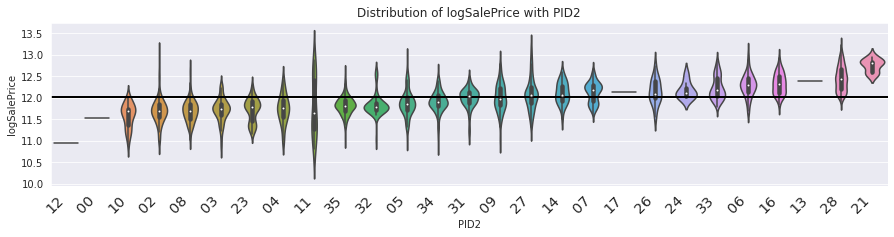


```
41502914308
526301100
```


    526301100


```
df.PID.head()
```


    0    526301100
    1    526350040
    2    526351010
    3    526353030
    4    527105010
    Name: PID, dtype: object


```
plot_categorical('PID3')
regression_model('PID3')
```


```
plot_categorical('PID4')
regression_model('PID4')
```


```
plot_categorical('Condition1')
regression_model('Condition1')
```


```
plot_categorical('Condition2')
regression_model('Condition2')
```


```
keyLocationAttributes = ['Neighborhood', 'PID2', 'Zone']
coef = regression_model(keyLocationAttributes, return_weights=True)
```


```
for i in coef:
    print(i.shape)
```

    (106, 100)
    (100, 1)


```
eM = coef[0]
eM.shape
```


    (106, 100)


# Context of Sale
* Does not seem to have any significant effect. 


```
plot_categorical('SaleCondition')
regression_model('SaleCondition')
```

    0.08989407979589081 0.14527501146496014


```
plot_categorical('SaleType')
regression_model('SaleType')
```

    0.10674419934127866 0.13913094584412988


```
plot_categorical('MoSold')
regression_model('MoSold')
```

    0.0009556132307242393 -0.014616219508186035


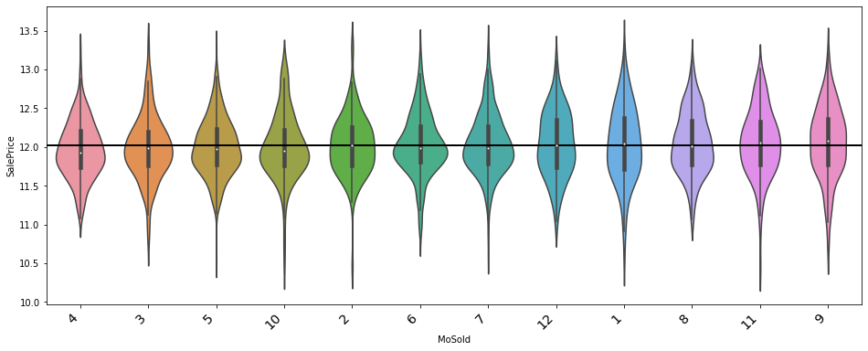


```
plot_categorical('YrSold')
regression_model('YrSold')
```

    -0.019410817390614676 -0.044146156948597026


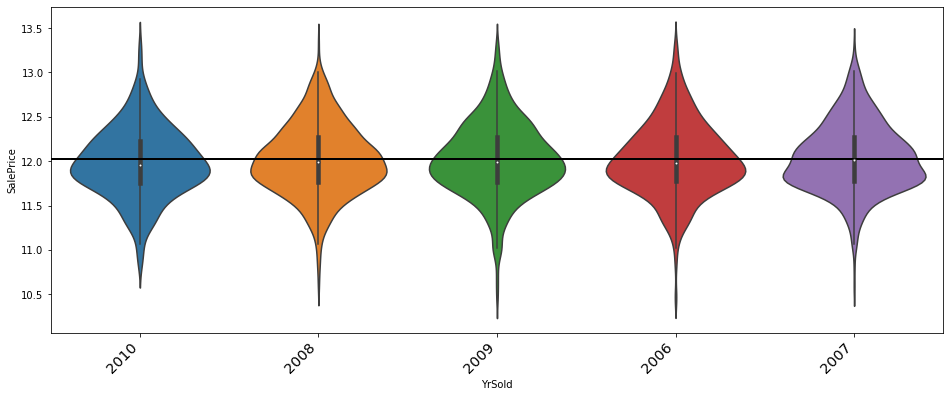


```
df['YrMoSold'] = df.YrSold.astype(str) + df.MoSold.astype(str)
plot_categorical('YrMoSold')
regression_model('YrMoSold')
```

    0.006909498505049849 -0.059339581739229486


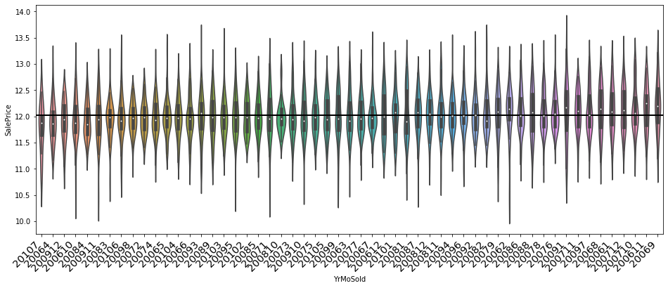


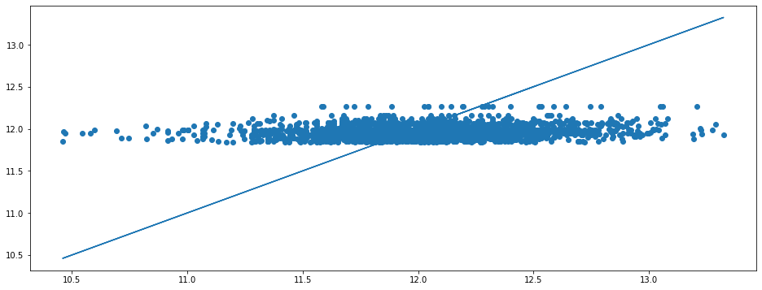


```
keyLocationAttributes = ['SaleType', 'SaleCondition']
coef = regression_model(keyLocationAttributes, return_weights=True)
```

# House Size & Area
* Key takeaways - The Right Definition of Floor Area should be applied. Price is dependent on the right area. 


```
df.select_dtypes(include = ['float', 'int']).head().columns
```


    Index(['Order', 'MSSubClass', 'LotFrontage', 'LotArea', 'OverallQual',
           'OverallCond', 'YearBuilt', 'YearRemod/Add', 'MasVnrArea', 'BsmtFinSF1',
           'BsmtFinSF2', 'BsmtUnfSF', 'TotalBsmtSF', '1stFlrSF', '2ndFlrSF',
           'LowQualFinSF', 'GrLivArea', 'BsmtFullBath', 'BsmtHalfBath', 'FullBath',
           'HalfBath', 'BedroomAbvGr', 'KitchenAbvGr', 'TotRmsAbvGrd',
           'Fireplaces', 'GarageYrBlt', 'GarageCars', 'GarageArea', 'WoodDeckSF',
           'OpenPorchSF', 'EnclosedPorch', '3SsnPorch', 'ScreenPorch', 'PoolArea',
           'MiscVal', 'MoSold', 'YrSold', 'SalePrice'],
          dtype='object')


```
df['PorchArea'] = df.OpenPorchSF +df.EnclosedPorch +df['3SsnPorch'] + df.ScreenPorch
df['FloorArea1'] = df.TotalBsmtSF + df['1stFlrSF'] + df['2ndFlrSF']
df['FloorArea2'] = df.TotalBsmtSF + df['1stFlrSF'] + df['2ndFlrSF'] + df.EnclosedPorch + df.ScreenPorch + df['3SsnPorch']
df['FloorArea3'] = df.BsmtFinSF1 + 2 * df['1stFlrSF'] + df['2ndFlrSF'] + df.WoodDeckSF + df.PorchArea + 2* df.GarageArea 
df['OutdoorArea']  = df.LotArea - df['1stFlrSF']
df['FloorAreaRatio'] = df['FloorArea3']/df['PorchArea']
#areaFeatures = ['LotArea', 'OutdoorArea', 'FloorArea1','FloorArea2','FloorArea3', 'GrLivArea', 'GarageArea']
areaFeatures = ['LotArea', 'MasVnrArea', 'BsmtFinSF1',
       'BsmtFinSF2', 'BsmtUnfSF', 'TotalBsmtSF', '1stFlrSF', '2ndFlrSF',
       'LowQualFinSF', 'GrLivArea', 'GarageArea', 'WoodDeckSF',
       'OpenPorchSF', 'EnclosedPorch', '3SsnPorch', 'ScreenPorch', 'PoolArea',
       'FloorArea3', 'FloorArea2', 'FloorArea1', 'PorchArea', 'OutdoorArea', 'FloorAreaRatio'
       ]
df[areaFeatures] = df[areaFeatures].fillna(0)
df[areaFeatures].head()
```


<div>
<style scoped>
    .dataframe tbody tr th:only-of-type {
        vertical-align: middle;
    }

    .dataframe tbody tr th {
        vertical-align: top;
    }

    .dataframe thead th {
        text-align: right;
    }
</style>
<table border="1" class="dataframe">
  <thead>
    <tr style="text-align: right;">
      <th></th>
      <th>LotArea</th>
      <th>MasVnrArea</th>
      <th>BsmtFinSF1</th>
      <th>BsmtFinSF2</th>
      <th>BsmtUnfSF</th>
      <th>TotalBsmtSF</th>
      <th>1stFlrSF</th>
      <th>2ndFlrSF</th>
      <th>LowQualFinSF</th>
      <th>GrLivArea</th>
      <th>GarageArea</th>
      <th>WoodDeckSF</th>
      <th>OpenPorchSF</th>
      <th>EnclosedPorch</th>
      <th>3SsnPorch</th>
      <th>ScreenPorch</th>
      <th>PoolArea</th>
      <th>FloorArea3</th>
      <th>FloorArea2</th>
      <th>FloorArea1</th>
      <th>PorchArea</th>
      <th>OutdoorArea</th>
      <th>FloorAreaRatio</th>
    </tr>
  </thead>
  <tbody>
    <tr>
      <th>726</th>
      <td>7879</td>
      <td>0.0</td>
      <td>495.0</td>
      <td>0.0</td>
      <td>225.0</td>
      <td>720.0</td>
      <td>720</td>
      <td>0</td>
      <td>0</td>
      <td>720</td>
      <td>0.0</td>
      <td>0</td>
      <td>523</td>
      <td>115</td>
      <td>0</td>
      <td>0</td>
      <td>0</td>
      <td>2573.0</td>
      <td>1555.0</td>
      <td>1440.0</td>
      <td>638</td>
      <td>7159</td>
      <td>4.032915</td>
    </tr>
    <tr>
      <th>2843</th>
      <td>8088</td>
      <td>0.0</td>
      <td>0.0</td>
      <td>0.0</td>
      <td>498.0</td>
      <td>498.0</td>
      <td>498</td>
      <td>0</td>
      <td>0</td>
      <td>498</td>
      <td>216.0</td>
      <td>0</td>
      <td>0</td>
      <td>100</td>
      <td>0</td>
      <td>0</td>
      <td>0</td>
      <td>1528.0</td>
      <td>1096.0</td>
      <td>996.0</td>
      <td>100</td>
      <td>7590</td>
      <td>15.280000</td>
    </tr>
    <tr>
      <th>2880</th>
      <td>9000</td>
      <td>0.0</td>
      <td>50.0</td>
      <td>0.0</td>
      <td>430.0</td>
      <td>480.0</td>
      <td>480</td>
      <td>0</td>
      <td>0</td>
      <td>480</td>
      <td>308.0</td>
      <td>0</td>
      <td>0</td>
      <td>0</td>
      <td>0</td>
      <td>0</td>
      <td>0</td>
      <td>1626.0</td>
      <td>960.0</td>
      <td>960.0</td>
      <td>0</td>
      <td>8520</td>
      <td>inf</td>
    </tr>
    <tr>
      <th>709</th>
      <td>5925</td>
      <td>0.0</td>
      <td>0.0</td>
      <td>0.0</td>
      <td>600.0</td>
      <td>600.0</td>
      <td>600</td>
      <td>368</td>
      <td>0</td>
      <td>968</td>
      <td>0.0</td>
      <td>0</td>
      <td>0</td>
      <td>0</td>
      <td>0</td>
      <td>0</td>
      <td>0</td>
      <td>1568.0</td>
      <td>1568.0</td>
      <td>1568.0</td>
      <td>0</td>
      <td>5325</td>
      <td>inf</td>
    </tr>
    <tr>
      <th>1901</th>
      <td>5000</td>
      <td>0.0</td>
      <td>0.0</td>
      <td>0.0</td>
      <td>0.0</td>
      <td>0.0</td>
      <td>334</td>
      <td>0</td>
      <td>0</td>
      <td>334</td>
      <td>0.0</td>
      <td>0</td>
      <td>0</td>
      <td>0</td>
      <td>0</td>
      <td>0</td>
      <td>0</td>
      <td>668.0</td>
      <td>334.0</td>
      <td>334.0</td>
      <td>0</td>
      <td>4666</td>
      <td>inf</td>
    </tr>
  </tbody>
</table>
</div>


```
plt.figure(figsize=(15, 15))
sns.heatmap(df[['SalePrice']+ areaFeatures].corr(), annot=True, cmap = 'Blues')
```


    <matplotlib.axes._subplots.AxesSubplot at 0x7f5acf6b9208>


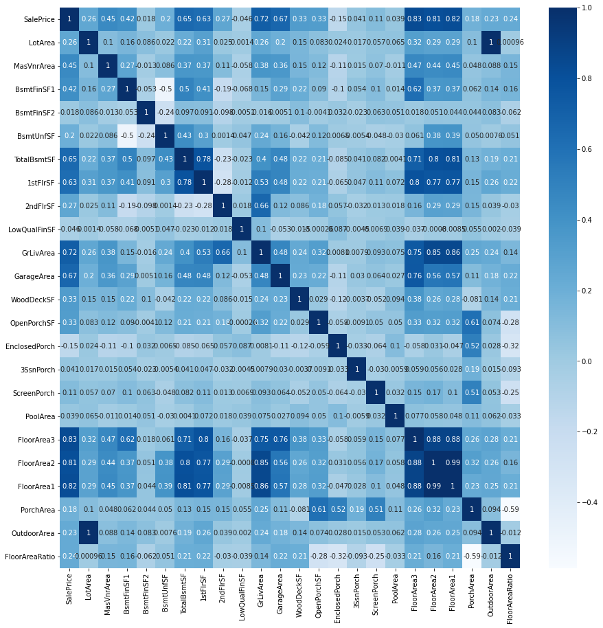


```
areaFeatures = ['TotalBsmtSF', 'GrLivArea', 'GarageArea','FloorArea1']
```


```
from sklearn.neural_network import MLPRegressor
from sklearn.linear_model import LinearRegression, Ridge, Lasso
from sklearn.model_selection import train_test_split
from sklearn.metrics import r2_score
def regression_model2(var, return_weights = False):
    model = MLPRegressor(hidden_layer_sizes=(100, ), alpha = 3, learning_rate_init=0.01, max_iter=20000, random_state = 42)
    y = df.SalePrice
    df[var] = (df[var]-df[var].mean(axis = 0))/(df[var].std(axis = 0))
    x, y = df[var], df.SalePrice
    x_train, x_val, y_train, y_val = train_test_split(x, y, test_size = 0.3, random_state = 42)
    model.fit(x_train, y_train)
    print(r2_score(y_train, model.predict(x_train)), r2_score(y_val, model.predict(x_val)))
    if return_weights == True:
        return model.coefs_
        
    plt.figure(figsize=(16, 6))
    plt.plot(y_train, y_train)
    plt.scatter(y_train, model.predict(x_train))
    plt.show()

    for i in var:
        plt.scatter(x_train[i], model.predict(x_train))
        plt.title(i)
        plt.show()

```


```
areaFeatures = ['TotalBsmtSF', 'GrLivArea', 'GarageArea','FloorArea1']
regression_model2(areaFeatures)
```

    0.7269140738653929 0.7390095585649867


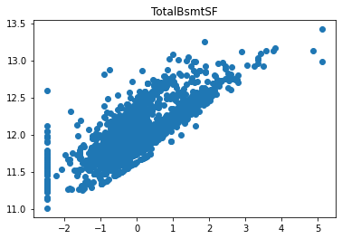


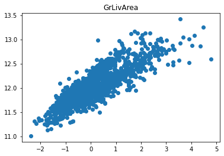


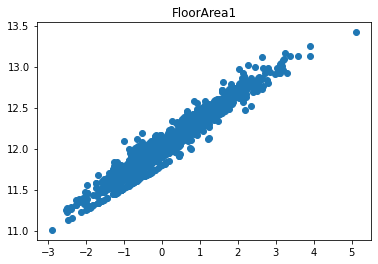


```
f = list(df.columns)
f.drop('Order', 'PID')
```


    Index(['Order', 'PID', 'MSSubClass', 'MSZoning', 'LotFrontage', 'LotArea',
           'Street', 'Alley', 'LotShape', 'LandContour', 'Utilities', 'LotConfig',
           'LandSlope', 'Neighborhood', 'Condition1', 'Condition2', 'BldgType',
           'HouseStyle', 'OverallQual', 'OverallCond', 'YearBuilt',
           'YearRemod/Add', 'RoofStyle', 'RoofMatl', 'Exterior1st', 'Exterior2nd',
           'MasVnrType', 'MasVnrArea', 'ExterQual', 'ExterCond', 'Foundation',
           'BsmtQual', 'BsmtCond', 'BsmtExposure', 'BsmtFinType1', 'BsmtFinSF1',
           'BsmtFinType2', 'BsmtFinSF2', 'BsmtUnfSF', 'TotalBsmtSF', 'Heating',
           'HeatingQC', 'CentralAir', 'Electrical', '1stFlrSF', '2ndFlrSF',
           'LowQualFinSF', 'GrLivArea', 'BsmtFullBath', 'BsmtHalfBath', 'FullBath',
           'HalfBath', 'BedroomAbvGr', 'KitchenAbvGr', 'KitchenQual',
           'TotRmsAbvGrd', 'Functional', 'Fireplaces', 'FireplaceQu', 'GarageType',
           'GarageYrBlt', 'GarageFinish', 'GarageCars', 'GarageArea', 'GarageQual',
           'GarageCond', 'PavedDrive', 'WoodDeckSF', 'OpenPorchSF',
           'EnclosedPorch', '3SsnPorch', 'ScreenPorch', 'PoolArea', 'PoolQC',
           'Fence', 'MiscFeature', 'MiscVal', 'MoSold', 'YrSold', 'SaleType',
           'SaleCondition', 'SalePrice', 'PorchArea', 'FloorArea1', 'FloorArea2',
           'FloorArea3', 'OutdoorArea', 'FloorAreaRatio'],
          dtype='object')


```
var = areaFeatures
model = MLPRegressor(hidden_layer_sizes=(100, ), alpha = 3, learning_rate_init=0.01, max_iter=10000, random_state = 42)
y = df.SalePrice
df[var] = (df[var]-df[var].mean(axis = 0))/(df[var].std(axis = 0))
x, y = df[var], df.SalePrice
x_train, x_val, y_train, y_val = train_test_split(x, y, test_size = 0.3, random_state = 42)
model.fit(x_train, y_train)
print(r2_score(y_train, model.predict(x_train)), r2_score(y_val, model.predict(x_val)))
```

    0.6911405032509836 0.6901373049147072


```
yhat_train = model.predict(x_train)
yhat_test = model.predict(x_val)
```


```
yhat = model.predict(x[areaFeatures])
```


```
var = ['Neighborhood', 'PID2', 'Zone']
x2 = pd.DataFrame([[]])
for i in var:
    x2 = pd.concat([x2, pd.get_dummies(df[i])], axis = 1)
y2 = yhat
x2.shape, y2.shape

```


    ((2918, 106), (2918,))


```
x_train2, x_val2, y_train2, y_val2 = train_test_split(x2, y2, test_size = 0.3, random_state = 42)
model2 = MLPRegressor(hidden_layer_sizes=(100, ), alpha = 3, learning_rate_init=0.01, max_iter=10000, random_state = 42)
model2.fit(x_train2, y_train2)
print(r2_score(y_train2, model2.predict(x_train2)), r2_score(y_val2, model2.predict(x_val2)))
```

    0.04855021237855084 -0.035088942405500756


# Interior Components


```

```
