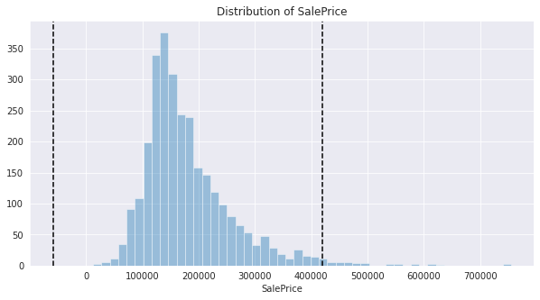
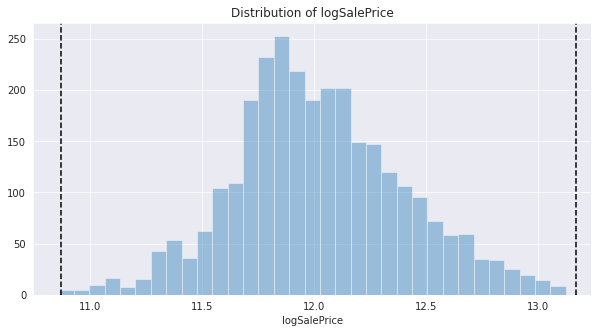
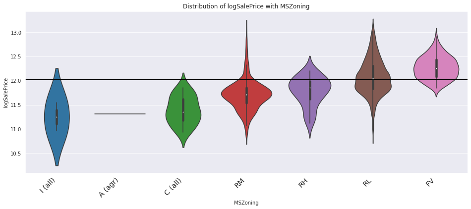
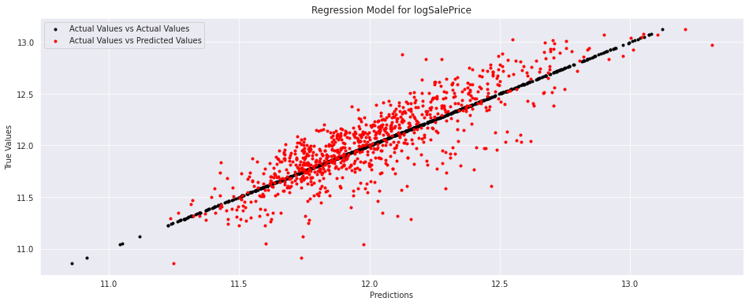
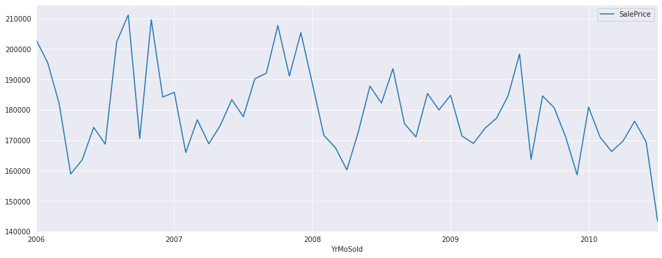
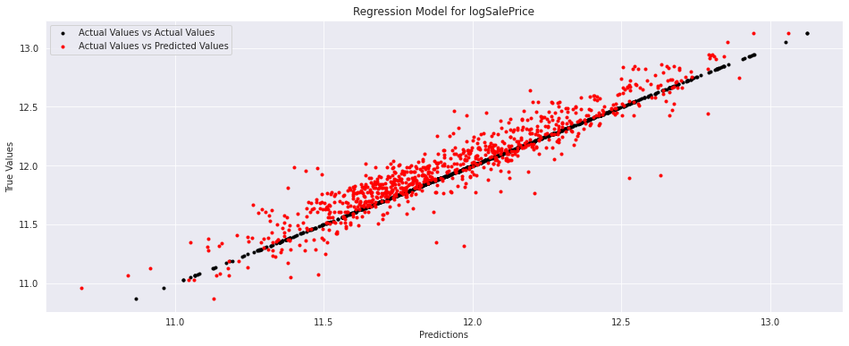
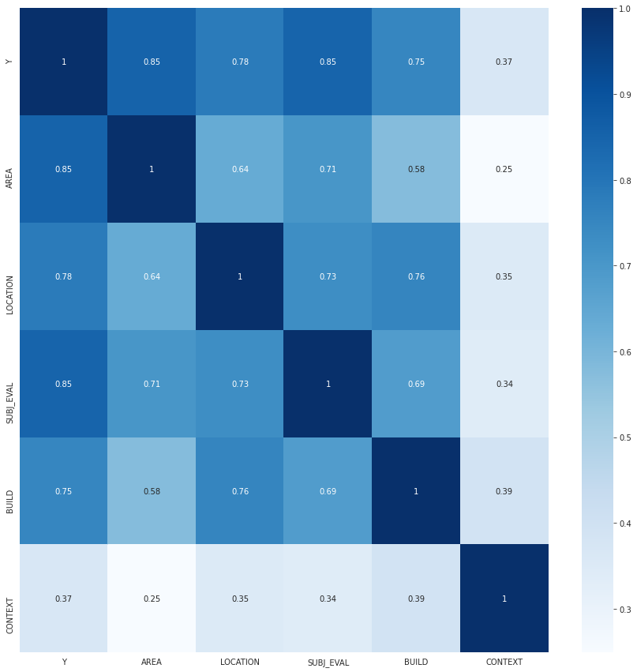

# **Introduction**

One of the most fascinating datasets that I've come across is the Ames Housing dataset. It was originally collated by Dr. Dean De Cock (Truman State Univ) for the undergraduate statistical methods course, and later became very popular through Kaggle.

For about 3000 houses sold in Ames City (Iowa, US) between 2006 and 2010, are given the following info: 
 * Location of the House
 * House Size and Area Measurements
 * Furnishing of the House
 * Subjective Evaluations of House
 * Immediate Context of Sale

Our objective is to predict and explain the Sale Price of the house based on its location, size, furnishing, quality, context etc.

References:
 * [Author's Introduction](https://tinyurl.com/ycfc58y8)
 * [Data Dictionary](http://jse.amstat.org/v19n3/decock/DataDocumentation.txt)
 * [Data in Excel](https://tinyurl.com/ycbbw3h7)


```
PATH = '/content/drive/My Drive/Projects/Machine Learning/Real World Problems/Housing Prices/AmesHousing.xls'
import pandas as pd
df = pd.read_excel(PATH)
df.columns = [i.replace(' ', '') for i in df.columns]
print(df[['PID', 'SalePrice', 'Neighborhood', 'GrLivArea', 'YrSold', 'MoSold']].sample(frac = 1).head(10))
```

                PID  SalePrice Neighborhood  GrLivArea  YrSold  MoSold
    57    528250100     180000      Gilbert       1430    2010       4
    355   527162120     191000      Gilbert       1636    2009      10
    1132  531371070     188000      SawyerW       1696    2008       7
    2449  528358030     350000      NoRidge       2726    2006       6
    2176  908152180     141000      Edwards       2233    2007       2
    2651  902204060     135500      OldTown        960    2006       6
    838   907131090     212000      CollgCr       1661    2009       4
    1003  527161010     181000      Gilbert       1604    2008       7
    951   914475030     173000      Mitchel       1287    2009      11
    423   528106020     555000      NridgHt       2402    2009       4


# **Helper Functions**
*PlotDist* - Plots Historgram with μ ± 3σ Bars.

*CatPlot* - Plots LogSalePrice Distributions across ordinal values, ordered.

*DataGen* - Uses a list of variables to create training and test sets. Ensures numericals get standardized and ordinals get dummified. 

*NNReg* Function - Neural Net Regression between LogSalePrice and Selected Variables.


```
import seaborn as sns
sns.set_style("darkgrid")
import matplotlib.pyplot as plt
plt.rcParams["figure.figsize"] = (10,5)
def plotDist(var):
    sns.distplot(df[var], hist=True, kde = False)
    μ, σ = df[var].mean(), df[var].std()
    plt.axvline(μ - 3 * σ, color='black', linestyle = '--')
    plt.axvline(μ + 3 * σ, color='black', linestyle = '--')
    plt.title(f'Distribution of {var}')
    plt.show()
```


```
def CatPlot(var, sortVar = 'logSalePrice'):
    my_order = df[['logSalePrice', var]].groupby(by=var).mean().sort_values(sortVar).index
    chart = sns.violinplot(x=var, y='logSalePrice', data=df, order=my_order)
    chart.axhline(y = df.logSalePrice.mean(), color='black', linewidth=2) 
    chart.set_xticklabels(chart.get_xticklabels(), rotation=45, horizontalalignment='right',fontweight='light',fontsize='x-large')
    plt.title(f'Distribution of logSalePrice with {var}')
    plt.show()
```


```
from sklearn.model_selection import train_test_split
def DataGen(var):
    global df
    print(df.columns)
    y = df.logSalePrice
    x = df[var].copy()
    for i in x.select_dtypes(exclude = 'object'):
        ε = 0.0000001
        x[i] = (x[i]-x[i].mean(axis = 0)+ε)/(x[i].std(axis = 0)+ε)
    for i in x.select_dtypes(include = 'object').columns:
        x = pd.concat([x, pd.get_dummies(x[i])], axis = 1)
        x = x.drop(i, axis = 1)
    return train_test_split(x, y, test_size = 0.3, random_state = 42)
```


```
from sklearn.neural_network import MLPRegressor
from sklearn.linear_model import LinearRegression, Ridge, Lasso
from sklearn.metrics import r2_score
from warnings import filterwarnings
filterwarnings('ignore')
def NNReg(var, alpha = 2, yhat_and_y = False):
    x_train, x_val, y_train, y_val = DataGen(var)

    N_h1, N_h2 = round(x_train.shape[1] * 1.5), round(x_train.shape[1] * 0.5)
    model = MLPRegressor(hidden_layer_sizes = (N_h1, N_h2), alpha = alpha, max_iter = 500, random_state = 42, verbose = False)
    model.fit(x_train, y_train)
    yhat = model.predict(x_train)
    print(f'Train R Square: {r2_score(y_train, yhat):0.3f}')
    print(f'Test R Square: {r2_score(y_val, model.predict(x_val)):0.3f}')

    if yhat_and_y == True: 
        plt.figure(figsize=(16, 6))
        plt.scatter(y_val, y_val, c = 'black',  marker='.', label = 'Actual Values vs Actual Values')
        plt.scatter(model.predict(x_val), y_val, c = 'red', marker='.', label = 'Actual Values vs Predicted Values')
        plt.title('Regression Model for logSalePrice')
        plt.ylabel('True Values')
        plt.xlabel('Predictions')
        plt.legend()
        plt.show()
    
    return model
```

# **Variable of Interest: Sale Price**


```
plotDist('SalePrice')
```





Two observations: 
1. A majority of houses are sold for less, a minority of houses are sold for a really, really high amount. Sale Price exhibits high left skew, and thus needs to be log-transformed. Once done, it appears nearly normal.
2. Post log-transformation, we remove outliers outside μ ± 3σ. These examples were aberrations that could mislead. 


```
df['logSalePrice'] = np.log(df.SalePrice)
plotDist('logSalePrice')
```


* We remove outliers below and above these statistical thresholds. 
* Additionally, by the recommendation of the author we remove houses with "GrLivArea" greater than 4000. 


```
old_examples = df.shape[0]
df = df[(df.logSalePrice > μ - 3 * σ) & (df.logSalePrice < μ + 3 * σ) & (df.GrLivArea < 4000)]
new_examples = df.shape[0]
print('Old No of Examples:', old_examples)
print('New No of Examples:', new_examples)
print('Diff in Examples:', old_examples - new_examples)
plotDist('logSalePrice')
```

    Old No of Examples: 2930
    New No of Examples: 2898
    Diff in Examples: 32





# **Factors behind Sale Price**

* **Location of the House:** Ordinal attributes telling us the Neighborhood, Postal ID, Zoning allocation.
* **Size of the House:** Continous attributes which capture Sq Feet Area of the Lot, Living Space, Basement, etc.
* **Contents of the House:** Mainly count vectors telling us the no. of rooms, furnished items, etc.
* **Subjective Evaluations:** Subjective Evaluations such as 'Overall Quality' of different aspects.  
* **Immediate Context of Sale:** The time of year, the mode of payment and relation between seller & buyer.
* **Variations in Demand:** As proxied by no. of sales conducted before, in the neighborhood. 


# **Variation of Sale Price by Location** 


* Sale Price varies a lot by Neighborhood. 

* Residential & Commerical [Maps](https://www.cityofames.org/government/departments-divisions-a-h/city-assessor/maps)


```
PATH = '/content/drive/My Drive/Projects/Machine Learning/Real World Problems/Housing Prices/house-prices-advanced-regression-techniques/nbor.png'
from PIL import Image  
Image.open(PATH)
```


```
plt.rcParams["figure.figsize"] = (16,6)
CatPlot('Neighborhood')
```


* Sale Price is higher in Residential zones (more so in low density 'L') and floating villages (FV) and lower in Agricultural/Industrial zones.


```
CatPlot('MSZoning')
```





* The Parcel Number can be used to pin down the exact location of the house. 


```
df.PID = df.PID.astype(str) # Parcel Identification
df['PID1']=df.PID.str[0:1] # township
df['PID2']=df.PID.str[1:3] # section number
df['PID3']=df.PID.str[3:6] # quarter section (N, E, S, W, etc)
df['PID4']=df.PID.str[6:10] # parcel number within section
```


```
CatPlot('PID2')
```


* LOCATION is captured by Neighborhood, PID2 'Township-Sector' and Zone. 
* We can explain upto 60% of the variation in Sale Price
* However, LOCATION cannot tell explain extremely large variations in Sale Price


```
LOCATION = ['Neighborhood', 'PID2', 'MSZoning']
modelLOCATION = NNReg(LOCATION, yhat_and_y = True)
```

    Index(['Order', 'PID', 'MSSubClass', 'MSZoning', 'LotFrontage', 'LotArea',
           'Street', 'Alley', 'LotShape', 'LandContour', 'Utilities', 'LotConfig',
           'LandSlope', 'Neighborhood', 'Condition1', 'Condition2', 'BldgType',
           'HouseStyle', 'OverallQual', 'OverallCond', 'YearBuilt',
           'YearRemod/Add', 'RoofStyle', 'RoofMatl', 'Exterior1st', 'Exterior2nd',
           'MasVnrType', 'MasVnrArea', 'ExterQual', 'ExterCond', 'Foundation',
           'BsmtQual', 'BsmtCond', 'BsmtExposure', 'BsmtFinType1', 'BsmtFinSF1',
           'BsmtFinType2', 'BsmtFinSF2', 'BsmtUnfSF', 'TotalBsmtSF', 'Heating',
           'HeatingQC', 'CentralAir', 'Electrical', '1stFlrSF', '2ndFlrSF',
           'LowQualFinSF', 'GrLivArea', 'BsmtFullBath', 'BsmtHalfBath', 'FullBath',
           'HalfBath', 'BedroomAbvGr', 'KitchenAbvGr', 'KitchenQual',
           'TotRmsAbvGrd', 'Functional', 'Fireplaces', 'FireplaceQu', 'GarageType',
           'GarageYrBlt', 'GarageFinish', 'GarageCars', 'GarageArea', 'GarageQual',
           'GarageCond', 'PavedDrive', 'WoodDeckSF', 'OpenPorchSF',
           'EnclosedPorch', '3SsnPorch', 'ScreenPorch', 'PoolArea', 'PoolQC',
           'Fence', 'MiscFeature', 'MiscVal', 'MoSold', 'YrSold', 'SaleType',
           'SaleCondition', 'SalePrice', 'logSalePrice', 'PID1', 'PID2', 'PID3',
           'PID4'],
          dtype='object')
    Train R Square: 0.603
    Test R Square: 0.608


# **House Size & Area**
* While the house Lot Area (complete enclosure) is much larger, Prices depend more on the actual "Floor Area"/"Living Area". 
* Floor Area includes the Living spaces, enclosed Porchs, Garage, etc. And definitions vary. 
* After some trial and error: Floor Area = Basement + First & Second Floor + Garage Area 


```
df['PorchArea'] = df.OpenPorchSF + df.EnclosedPorch + df['3SsnPorch'] + df.ScreenPorch
df['FloorArea'] = df.TotalBsmtSF + df['1stFlrSF'] + df['2ndFlrSF'] + df['GarageArea']
AREA = ['LotArea', 'TotalBsmtSF', 'GrLivArea', 'GarageArea',  'PoolArea', 'FloorArea', 'PorchArea']
df[AREA] = df[AREA].fillna(0)
```


```
plt.figure(figsize=(15, 15))
sns.heatmap(df[['SalePrice']+ AREA].corr(), annot=True, cmap = 'Blues')
plt.show()
```


```
modelAREA = NNReg(AREA, alpha=10, yhat_and_y = True)
```

    Index(['Order', 'PID', 'MSSubClass', 'MSZoning', 'LotFrontage', 'LotArea',
           'Street', 'Alley', 'LotShape', 'LandContour', 'Utilities', 'LotConfig',
           'LandSlope', 'Neighborhood', 'Condition1', 'Condition2', 'BldgType',
           'HouseStyle', 'OverallQual', 'OverallCond', 'YearBuilt',
           'YearRemod/Add', 'RoofStyle', 'RoofMatl', 'Exterior1st', 'Exterior2nd',
           'MasVnrType', 'MasVnrArea', 'ExterQual', 'ExterCond', 'Foundation',
           'BsmtQual', 'BsmtCond', 'BsmtExposure', 'BsmtFinType1', 'BsmtFinSF1',
           'BsmtFinType2', 'BsmtFinSF2', 'BsmtUnfSF', 'TotalBsmtSF', 'Heating',
           'HeatingQC', 'CentralAir', 'Electrical', '1stFlrSF', '2ndFlrSF',
           'LowQualFinSF', 'GrLivArea', 'BsmtFullBath', 'BsmtHalfBath', 'FullBath',
           'HalfBath', 'BedroomAbvGr', 'KitchenAbvGr', 'KitchenQual',
           'TotRmsAbvGrd', 'Functional', 'Fireplaces', 'FireplaceQu', 'GarageType',
           'GarageYrBlt', 'GarageFinish', 'GarageCars', 'GarageArea', 'GarageQual',
           'GarageCond', 'PavedDrive', 'WoodDeckSF', 'OpenPorchSF',
           'EnclosedPorch', '3SsnPorch', 'ScreenPorch', 'PoolArea', 'PoolQC',
           'Fence', 'MiscFeature', 'MiscVal', 'MoSold', 'YrSold', 'SaleType',
           'SaleCondition', 'SalePrice', 'logSalePrice', 'PID1', 'PID2', 'PID3',
           'PID4', 'PorchArea', 'FloorArea'],
          dtype='object')
    Train R Square: 0.725
    Test R Square: 0.712





# **Subjective Evaluations**


```
SUBJ_EVAL = ['OverallQual', 'OverallCond', 'ExterQual', 'ExterCond', 'FireplaceQu', 'BsmtCond']
model_SUBJ_EVAL = NNReg(SUBJ_EVAL)
```

    Index(['Order', 'PID', 'MSSubClass', 'MSZoning', 'LotFrontage', 'LotArea',
           'Street', 'Alley', 'LotShape', 'LandContour', 'Utilities', 'LotConfig',
           'LandSlope', 'Neighborhood', 'Condition1', 'Condition2', 'BldgType',
           'HouseStyle', 'OverallQual', 'OverallCond', 'YearBuilt',
           'YearRemod/Add', 'RoofStyle', 'RoofMatl', 'Exterior1st', 'Exterior2nd',
           'MasVnrType', 'MasVnrArea', 'ExterQual', 'ExterCond', 'Foundation',
           'BsmtQual', 'BsmtCond', 'BsmtExposure', 'BsmtFinType1', 'BsmtFinSF1',
           'BsmtFinType2', 'BsmtFinSF2', 'BsmtUnfSF', 'TotalBsmtSF', 'Heating',
           'HeatingQC', 'CentralAir', 'Electrical', '1stFlrSF', '2ndFlrSF',
           'LowQualFinSF', 'GrLivArea', 'BsmtFullBath', 'BsmtHalfBath', 'FullBath',
           'HalfBath', 'BedroomAbvGr', 'KitchenAbvGr', 'KitchenQual',
           'TotRmsAbvGrd', 'Functional', 'Fireplaces', 'FireplaceQu', 'GarageType',
           'GarageYrBlt', 'GarageFinish', 'GarageCars', 'GarageArea', 'GarageQual',
           'GarageCond', 'PavedDrive', 'WoodDeckSF', 'OpenPorchSF',
           'EnclosedPorch', '3SsnPorch', 'ScreenPorch', 'PoolArea', 'PoolQC',
           'Fence', 'MiscFeature', 'MiscVal', 'MoSold', 'YrSold', 'SaleType',
           'SaleCondition', 'SalePrice', 'logSalePrice', 'PID1', 'PID2', 'PID3',
           'PID4', 'PorchArea', 'FloorArea'],
          dtype='object')
    Train R Square: 0.707
    Test R Square: 0.729


# **House Build**


```
df['Age'] = df.YrSold - df.YearBuilt
df['AgeRemod'] = df['YrSold'] - df['YearRemod/Add']
BUILD = ['Age', 'MSSubClass', 'LandContour', 'LotConfig', 
         'LotShape', 'BldgType', 'HouseStyle', 'AgeRemod']

model_BUILD = NNReg(BUILD, yhat_and_y=True)
```

    Index(['Order', 'PID', 'MSSubClass', 'MSZoning', 'LotFrontage', 'LotArea',
           'Street', 'Alley', 'LotShape', 'LandContour', 'Utilities', 'LotConfig',
           'LandSlope', 'Neighborhood', 'Condition1', 'Condition2', 'BldgType',
           'HouseStyle', 'OverallQual', 'OverallCond', 'YearBuilt',
           'YearRemod/Add', 'RoofStyle', 'RoofMatl', 'Exterior1st', 'Exterior2nd',
           'MasVnrType', 'MasVnrArea', 'ExterQual', 'ExterCond', 'Foundation',
           'BsmtQual', 'BsmtCond', 'BsmtExposure', 'BsmtFinType1', 'BsmtFinSF1',
           'BsmtFinType2', 'BsmtFinSF2', 'BsmtUnfSF', 'TotalBsmtSF', 'Heating',
           'HeatingQC', 'CentralAir', 'Electrical', '1stFlrSF', '2ndFlrSF',
           'LowQualFinSF', 'GrLivArea', 'BsmtFullBath', 'BsmtHalfBath', 'FullBath',
           'HalfBath', 'BedroomAbvGr', 'KitchenAbvGr', 'KitchenQual',
           'TotRmsAbvGrd', 'Functional', 'Fireplaces', 'FireplaceQu', 'GarageType',
           'GarageYrBlt', 'GarageFinish', 'GarageCars', 'GarageArea', 'GarageQual',
           'GarageCond', 'PavedDrive', 'WoodDeckSF', 'OpenPorchSF',
           'EnclosedPorch', '3SsnPorch', 'ScreenPorch', 'PoolArea', 'PoolQC',
           'Fence', 'MiscFeature', 'MiscVal', 'MoSold', 'YrSold', 'SaleType',
           'SaleCondition', 'SalePrice', 'logSalePrice', 'PID1', 'PID2', 'PID3',
           'PID4', 'PorchArea', 'FloorArea', 'Age', 'AgeRemod'],
          dtype='object')
    Train R Square: 0.576
    Test R Square: 0.539


# **Context of Sale**
* Does not seem to have any significant effect. 
* For example, 


```
df['YrMoSold'] = df.YrSold.astype(str) + df["MoSold"].astype(str).str.pad(2, side ='left', fillchar='0')
df['YrMoSold'] = pd.to_datetime(df['YrMoSold'], format = '%Y%m')
df = df.sort_values(by = 'YrMoSold')
df[['SalePrice', 'YrMoSold']].groupby('YrMoSold').mean().plot()
```


    <matplotlib.axes._subplots.AxesSubplot at 0x7f59b4efb780>





```
CONTEXT = ['SaleType', 'SaleCondition', 'YrSold', 'MoSold']
model_CONTEXT = NNReg(CONTEXT)
```

    Index(['Order', 'PID', 'MSSubClass', 'MSZoning', 'LotFrontage', 'LotArea',
           'Street', 'Alley', 'LotShape', 'LandContour', 'Utilities', 'LotConfig',
           'LandSlope', 'Neighborhood', 'Condition1', 'Condition2', 'BldgType',
           'HouseStyle', 'OverallQual', 'OverallCond', 'YearBuilt',
           'YearRemod/Add', 'RoofStyle', 'RoofMatl', 'Exterior1st', 'Exterior2nd',
           'MasVnrType', 'MasVnrArea', 'ExterQual', 'ExterCond', 'Foundation',
           'BsmtQual', 'BsmtCond', 'BsmtExposure', 'BsmtFinType1', 'BsmtFinSF1',
           'BsmtFinType2', 'BsmtFinSF2', 'BsmtUnfSF', 'TotalBsmtSF', 'Heating',
           'HeatingQC', 'CentralAir', 'Electrical', '1stFlrSF', '2ndFlrSF',
           'LowQualFinSF', 'GrLivArea', 'BsmtFullBath', 'BsmtHalfBath', 'FullBath',
           'HalfBath', 'BedroomAbvGr', 'KitchenAbvGr', 'KitchenQual',
           'TotRmsAbvGrd', 'Functional', 'Fireplaces', 'FireplaceQu', 'GarageType',
           'GarageYrBlt', 'GarageFinish', 'GarageCars', 'GarageArea', 'GarageQual',
           'GarageCond', 'PavedDrive', 'WoodDeckSF', 'OpenPorchSF',
           'EnclosedPorch', '3SsnPorch', 'ScreenPorch', 'PoolArea', 'PoolQC',
           'Fence', 'MiscFeature', 'MiscVal', 'MoSold', 'YrSold', 'SaleType',
           'SaleCondition', 'SalePrice', 'logSalePrice', 'PID1', 'PID2', 'PID3',
           'PID4', 'PorchArea', 'FloorArea', 'Age', 'AgeRemod', 'YrMoSold'],
          dtype='object')
    Train R Square: 0.129
    Test R Square: 0.150


# **Demand**

* Follows a seasonal pattern. Peak season prices might obtain higher margin of sale due to peak demand.


```
df[['SalePrice', 'YrMoSold']].groupby('YrMoSold').count().plot()
```


    <matplotlib.axes._subplots.AxesSubplot at 0x7f59b4ee8eb8>


```
dm = df[['SalePrice', 'YrMoSold']].groupby('YrMoSold').count()
dm = pd.concat([dm, dm.shift(1), dm.shift(2), dm.shift(3)], axis = 1)
dm.columns = ['QtSold_T', 'QtSold_T-1', 'QtSold_T-2', 'QtSold_T-3']
dm.reset_index(inplace = True)
dm.fillna(0, inplace = True)
df = pd.merge(df, dm, on = 'YrMoSold')
```


```
df.head()
```


<div>
<style scoped>
    .dataframe tbody tr th:only-of-type {
        vertical-align: middle;
    }

    .dataframe tbody tr th {
        vertical-align: top;
    }

    .dataframe thead th {
        text-align: right;
    }
</style>
<table border="1" class="dataframe">
  <thead>
    <tr style="text-align: right;">
      <th></th>
      <th>Order</th>
      <th>PID</th>
      <th>MSSubClass</th>
      <th>MSZoning</th>
      <th>LotFrontage</th>
      <th>LotArea</th>
      <th>Street</th>
      <th>Alley</th>
      <th>LotShape</th>
      <th>LandContour</th>
      <th>Utilities</th>
      <th>LotConfig</th>
      <th>LandSlope</th>
      <th>Neighborhood</th>
      <th>Condition1</th>
      <th>Condition2</th>
      <th>BldgType</th>
      <th>HouseStyle</th>
      <th>OverallQual</th>
      <th>OverallCond</th>
      <th>YearBuilt</th>
      <th>YearRemod/Add</th>
      <th>RoofStyle</th>
      <th>RoofMatl</th>
      <th>Exterior1st</th>
      <th>Exterior2nd</th>
      <th>MasVnrType</th>
      <th>MasVnrArea</th>
      <th>ExterQual</th>
      <th>ExterCond</th>
      <th>Foundation</th>
      <th>BsmtQual</th>
      <th>BsmtCond</th>
      <th>BsmtExposure</th>
      <th>BsmtFinType1</th>
      <th>BsmtFinSF1</th>
      <th>BsmtFinType2</th>
      <th>BsmtFinSF2</th>
      <th>BsmtUnfSF</th>
      <th>TotalBsmtSF</th>
      <th>...</th>
      <th>Functional</th>
      <th>Fireplaces</th>
      <th>FireplaceQu</th>
      <th>GarageType</th>
      <th>GarageYrBlt</th>
      <th>GarageFinish</th>
      <th>GarageCars</th>
      <th>GarageArea</th>
      <th>GarageQual</th>
      <th>GarageCond</th>
      <th>PavedDrive</th>
      <th>WoodDeckSF</th>
      <th>OpenPorchSF</th>
      <th>EnclosedPorch</th>
      <th>3SsnPorch</th>
      <th>ScreenPorch</th>
      <th>PoolArea</th>
      <th>PoolQC</th>
      <th>Fence</th>
      <th>MiscFeature</th>
      <th>MiscVal</th>
      <th>MoSold</th>
      <th>YrSold</th>
      <th>SaleType</th>
      <th>SaleCondition</th>
      <th>SalePrice</th>
      <th>logSalePrice</th>
      <th>PID1</th>
      <th>PID2</th>
      <th>PID3</th>
      <th>PID4</th>
      <th>PorchArea</th>
      <th>FloorArea</th>
      <th>Age</th>
      <th>AgeRemod</th>
      <th>YrMoSold</th>
      <th>QtSold_T</th>
      <th>QtSold_T-1</th>
      <th>QtSold_T-2</th>
      <th>QtSold_T-3</th>
    </tr>
  </thead>
  <tbody>
    <tr>
      <th>0</th>
      <td>2499</td>
      <td>532476050</td>
      <td>80</td>
      <td>RL</td>
      <td>100.0</td>
      <td>14330</td>
      <td>Pave</td>
      <td>NaN</td>
      <td>IR1</td>
      <td>Low</td>
      <td>AllPub</td>
      <td>Corner</td>
      <td>Gtl</td>
      <td>Veenker</td>
      <td>Norm</td>
      <td>Norm</td>
      <td>1Fam</td>
      <td>SLvl</td>
      <td>7</td>
      <td>4</td>
      <td>1974</td>
      <td>1974</td>
      <td>Gable</td>
      <td>CompShg</td>
      <td>WdShing</td>
      <td>Wd Sdng</td>
      <td>BrkFace</td>
      <td>145.0</td>
      <td>Gd</td>
      <td>Fa</td>
      <td>CBlock</td>
      <td>Gd</td>
      <td>TA</td>
      <td>Gd</td>
      <td>ALQ</td>
      <td>1023.0</td>
      <td>BLQ</td>
      <td>497.0</td>
      <td>228.0</td>
      <td>1748.0</td>
      <td>...</td>
      <td>Mod</td>
      <td>4</td>
      <td>TA</td>
      <td>Attchd</td>
      <td>1974.0</td>
      <td>RFn</td>
      <td>2.0</td>
      <td>550.0</td>
      <td>TA</td>
      <td>TA</td>
      <td>Y</td>
      <td>641</td>
      <td>100</td>
      <td>0</td>
      <td>0</td>
      <td>0</td>
      <td>800</td>
      <td>Gd</td>
      <td>GdPrv</td>
      <td>NaN</td>
      <td>0</td>
      <td>1</td>
      <td>2006</td>
      <td>WD</td>
      <td>Normal</td>
      <td>260000</td>
      <td>12.468437</td>
      <td>5</td>
      <td>32</td>
      <td>476</td>
      <td>050</td>
      <td>100</td>
      <td>4944.0</td>
      <td>32</td>
      <td>32</td>
      <td>2006-01-01</td>
      <td>18</td>
      <td>0.0</td>
      <td>0.0</td>
      <td>0.0</td>
    </tr>
    <tr>
      <th>1</th>
      <td>2319</td>
      <td>527108030</td>
      <td>60</td>
      <td>RL</td>
      <td>50.0</td>
      <td>13128</td>
      <td>Pave</td>
      <td>NaN</td>
      <td>IR1</td>
      <td>HLS</td>
      <td>AllPub</td>
      <td>CulDSac</td>
      <td>Gtl</td>
      <td>Gilbert</td>
      <td>Norm</td>
      <td>Norm</td>
      <td>1Fam</td>
      <td>2Story</td>
      <td>8</td>
      <td>5</td>
      <td>2005</td>
      <td>2005</td>
      <td>Gable</td>
      <td>CompShg</td>
      <td>VinylSd</td>
      <td>VinylSd</td>
      <td>BrkFace</td>
      <td>216.0</td>
      <td>Gd</td>
      <td>TA</td>
      <td>PConc</td>
      <td>Gd</td>
      <td>TA</td>
      <td>No</td>
      <td>Unf</td>
      <td>0.0</td>
      <td>Unf</td>
      <td>0.0</td>
      <td>1074.0</td>
      <td>1074.0</td>
      <td>...</td>
      <td>Typ</td>
      <td>1</td>
      <td>Gd</td>
      <td>Attchd</td>
      <td>2005.0</td>
      <td>Fin</td>
      <td>2.0</td>
      <td>527.0</td>
      <td>TA</td>
      <td>TA</td>
      <td>Y</td>
      <td>0</td>
      <td>119</td>
      <td>0</td>
      <td>0</td>
      <td>0</td>
      <td>0</td>
      <td>NaN</td>
      <td>NaN</td>
      <td>NaN</td>
      <td>0</td>
      <td>1</td>
      <td>2006</td>
      <td>WD</td>
      <td>Normal</td>
      <td>250000</td>
      <td>12.429216</td>
      <td>5</td>
      <td>27</td>
      <td>108</td>
      <td>030</td>
      <td>119</td>
      <td>3665.0</td>
      <td>1</td>
      <td>1</td>
      <td>2006-01-01</td>
      <td>18</td>
      <td>0.0</td>
      <td>0.0</td>
      <td>0.0</td>
    </tr>
    <tr>
      <th>2</th>
      <td>2494</td>
      <td>532378050</td>
      <td>20</td>
      <td>RL</td>
      <td>NaN</td>
      <td>13052</td>
      <td>Pave</td>
      <td>NaN</td>
      <td>IR1</td>
      <td>Lvl</td>
      <td>AllPub</td>
      <td>CulDSac</td>
      <td>Gtl</td>
      <td>Sawyer</td>
      <td>Norm</td>
      <td>Norm</td>
      <td>1Fam</td>
      <td>1Story</td>
      <td>5</td>
      <td>6</td>
      <td>1965</td>
      <td>1965</td>
      <td>Gable</td>
      <td>CompShg</td>
      <td>HdBoard</td>
      <td>HdBoard</td>
      <td>None</td>
      <td>0.0</td>
      <td>TA</td>
      <td>TA</td>
      <td>CBlock</td>
      <td>TA</td>
      <td>TA</td>
      <td>No</td>
      <td>Rec</td>
      <td>712.0</td>
      <td>Unf</td>
      <td>0.0</td>
      <td>312.0</td>
      <td>1024.0</td>
      <td>...</td>
      <td>Typ</td>
      <td>0</td>
      <td>NaN</td>
      <td>Attchd</td>
      <td>1965.0</td>
      <td>Unf</td>
      <td>1.0</td>
      <td>308.0</td>
      <td>TA</td>
      <td>TA</td>
      <td>Y</td>
      <td>0</td>
      <td>0</td>
      <td>0</td>
      <td>0</td>
      <td>0</td>
      <td>0</td>
      <td>NaN</td>
      <td>MnPrv</td>
      <td>NaN</td>
      <td>0</td>
      <td>1</td>
      <td>2006</td>
      <td>WD</td>
      <td>Normal</td>
      <td>120875</td>
      <td>11.702512</td>
      <td>5</td>
      <td>32</td>
      <td>378</td>
      <td>050</td>
      <td>0</td>
      <td>2356.0</td>
      <td>41</td>
      <td>41</td>
      <td>2006-01-01</td>
      <td>18</td>
      <td>0.0</td>
      <td>0.0</td>
      <td>0.0</td>
    </tr>
    <tr>
      <th>3</th>
      <td>2358</td>
      <td>527377030</td>
      <td>20</td>
      <td>RL</td>
      <td>78.0</td>
      <td>10140</td>
      <td>Pave</td>
      <td>NaN</td>
      <td>Reg</td>
      <td>Lvl</td>
      <td>AllPub</td>
      <td>Inside</td>
      <td>Gtl</td>
      <td>NWAmes</td>
      <td>Norm</td>
      <td>Norm</td>
      <td>1Fam</td>
      <td>1Story</td>
      <td>6</td>
      <td>6</td>
      <td>1974</td>
      <td>1999</td>
      <td>Hip</td>
      <td>CompShg</td>
      <td>HdBoard</td>
      <td>HdBoard</td>
      <td>BrkFace</td>
      <td>99.0</td>
      <td>TA</td>
      <td>TA</td>
      <td>CBlock</td>
      <td>TA</td>
      <td>TA</td>
      <td>No</td>
      <td>ALQ</td>
      <td>663.0</td>
      <td>LwQ</td>
      <td>377.0</td>
      <td>0.0</td>
      <td>1040.0</td>
      <td>...</td>
      <td>Typ</td>
      <td>1</td>
      <td>Fa</td>
      <td>Attchd</td>
      <td>1974.0</td>
      <td>RFn</td>
      <td>2.0</td>
      <td>484.0</td>
      <td>TA</td>
      <td>TA</td>
      <td>Y</td>
      <td>265</td>
      <td>0</td>
      <td>0</td>
      <td>0</td>
      <td>0</td>
      <td>648</td>
      <td>Fa</td>
      <td>GdPrv</td>
      <td>NaN</td>
      <td>0</td>
      <td>1</td>
      <td>2006</td>
      <td>WD</td>
      <td>Normal</td>
      <td>181000</td>
      <td>12.106252</td>
      <td>5</td>
      <td>27</td>
      <td>377</td>
      <td>030</td>
      <td>0</td>
      <td>2833.0</td>
      <td>32</td>
      <td>7</td>
      <td>2006-01-01</td>
      <td>18</td>
      <td>0.0</td>
      <td>0.0</td>
      <td>0.0</td>
    </tr>
    <tr>
      <th>4</th>
      <td>2585</td>
      <td>535304020</td>
      <td>20</td>
      <td>RL</td>
      <td>66.0</td>
      <td>12778</td>
      <td>Pave</td>
      <td>NaN</td>
      <td>Reg</td>
      <td>Lvl</td>
      <td>AllPub</td>
      <td>Inside</td>
      <td>Gtl</td>
      <td>NAmes</td>
      <td>Norm</td>
      <td>Norm</td>
      <td>1Fam</td>
      <td>1Story</td>
      <td>5</td>
      <td>6</td>
      <td>1952</td>
      <td>2003</td>
      <td>Gable</td>
      <td>CompShg</td>
      <td>MetalSd</td>
      <td>MetalSd</td>
      <td>None</td>
      <td>0.0</td>
      <td>TA</td>
      <td>TA</td>
      <td>CBlock</td>
      <td>TA</td>
      <td>TA</td>
      <td>No</td>
      <td>GLQ</td>
      <td>658.0</td>
      <td>Unf</td>
      <td>0.0</td>
      <td>350.0</td>
      <td>1008.0</td>
      <td>...</td>
      <td>Typ</td>
      <td>0</td>
      <td>NaN</td>
      <td>Attchd</td>
      <td>1952.0</td>
      <td>RFn</td>
      <td>1.0</td>
      <td>280.0</td>
      <td>TA</td>
      <td>TA</td>
      <td>Y</td>
      <td>0</td>
      <td>154</td>
      <td>0</td>
      <td>0</td>
      <td>0</td>
      <td>0</td>
      <td>NaN</td>
      <td>MnPrv</td>
      <td>NaN</td>
      <td>0</td>
      <td>1</td>
      <td>2006</td>
      <td>WD</td>
      <td>Normal</td>
      <td>139500</td>
      <td>11.845820</td>
      <td>5</td>
      <td>35</td>
      <td>304</td>
      <td>020</td>
      <td>154</td>
      <td>2296.0</td>
      <td>54</td>
      <td>3</td>
      <td>2006-01-01</td>
      <td>18</td>
      <td>0.0</td>
      <td>0.0</td>
      <td>0.0</td>
    </tr>
  </tbody>
</table>
<p>5 rows × 96 columns</p>
</div>


```
df[DEMAND] = df[DEMAND].fillna(0)

```


```
DEMAND = ['QtSold_T-1', 'QtSold_T-2', 'QtSold_T-3']
NNReg(DEMAND, alpha = 0)
```

    Index(['Order', 'PID', 'MSSubClass', 'MSZoning', 'LotFrontage', 'LotArea',
           'Street', 'Alley', 'LotShape', 'LandContour', 'Utilities', 'LotConfig',
           'LandSlope', 'Neighborhood', 'Condition1', 'Condition2', 'BldgType',
           'HouseStyle', 'OverallQual', 'OverallCond', 'YearBuilt',
           'YearRemod/Add', 'RoofStyle', 'RoofMatl', 'Exterior1st', 'Exterior2nd',
           'MasVnrType', 'MasVnrArea', 'ExterQual', 'ExterCond', 'Foundation',
           'BsmtQual', 'BsmtCond', 'BsmtExposure', 'BsmtFinType1', 'BsmtFinSF1',
           'BsmtFinType2', 'BsmtFinSF2', 'BsmtUnfSF', 'TotalBsmtSF', 'Heating',
           'HeatingQC', 'CentralAir', 'Electrical', '1stFlrSF', '2ndFlrSF',
           'LowQualFinSF', 'GrLivArea', 'BsmtFullBath', 'BsmtHalfBath', 'FullBath',
           'HalfBath', 'BedroomAbvGr', 'KitchenAbvGr', 'KitchenQual',
           'TotRmsAbvGrd', 'Functional', 'Fireplaces', 'FireplaceQu', 'GarageType',
           'GarageYrBlt', 'GarageFinish', 'GarageCars', 'GarageArea', 'GarageQual',
           'GarageCond', 'PavedDrive', 'WoodDeckSF', 'OpenPorchSF',
           'EnclosedPorch', '3SsnPorch', 'ScreenPorch', 'PoolArea', 'PoolQC',
           'Fence', 'MiscFeature', 'MiscVal', 'MoSold', 'YrSold', 'SaleType',
           'SaleCondition', 'SalePrice', 'logSalePrice', 'PID1', 'PID2', 'PID3',
           'PID4', 'PorchArea', 'FloorArea', 'Age', 'AgeRemod', 'YrMoSold',
           'QtSold_T', 'QtSold_T-1', 'QtSold_T-2', 'QtSold_T-3'],
          dtype='object')
    Train R Square: -0.031
    Test R Square: -0.004


    MLPRegressor(activation='relu', alpha=0, batch_size='auto', beta_1=0.9,
                 beta_2=0.999, early_stopping=False, epsilon=1e-08,
                 hidden_layer_sizes=(4, 2), learning_rate='constant',
                 learning_rate_init=0.001, max_fun=15000, max_iter=500,
                 momentum=0.9, n_iter_no_change=10, nesterovs_momentum=True,
                 power_t=0.5, random_state=42, shuffle=True, solver='adam',
                 tol=0.0001, validation_fraction=0.1, verbose=False,
                 warm_start=False)


# **Common Model** 


```
model_COMMON = NNReg(AREA + LOCATION + SUBJ_EVAL + BUILD, yhat_and_y = True, alpha = 3)
```

    Index(['Order', 'PID', 'MSSubClass', 'MSZoning', 'LotFrontage', 'LotArea',
           'Street', 'Alley', 'LotShape', 'LandContour', 'Utilities', 'LotConfig',
           'LandSlope', 'Neighborhood', 'Condition1', 'Condition2', 'BldgType',
           'HouseStyle', 'OverallQual', 'OverallCond', 'YearBuilt',
           'YearRemod/Add', 'RoofStyle', 'RoofMatl', 'Exterior1st', 'Exterior2nd',
           'MasVnrType', 'MasVnrArea', 'ExterQual', 'ExterCond', 'Foundation',
           'BsmtQual', 'BsmtCond', 'BsmtExposure', 'BsmtFinType1', 'BsmtFinSF1',
           'BsmtFinType2', 'BsmtFinSF2', 'BsmtUnfSF', 'TotalBsmtSF', 'Heating',
           'HeatingQC', 'CentralAir', 'Electrical', '1stFlrSF', '2ndFlrSF',
           'LowQualFinSF', 'GrLivArea', 'BsmtFullBath', 'BsmtHalfBath', 'FullBath',
           'HalfBath', 'BedroomAbvGr', 'KitchenAbvGr', 'KitchenQual',
           'TotRmsAbvGrd', 'Functional', 'Fireplaces', 'FireplaceQu', 'GarageType',
           'GarageYrBlt', 'GarageFinish', 'GarageCars', 'GarageArea', 'GarageQual',
           'GarageCond', 'PavedDrive', 'WoodDeckSF', 'OpenPorchSF',
           'EnclosedPorch', '3SsnPorch', 'ScreenPorch', 'PoolArea', 'PoolQC',
           'Fence', 'MiscFeature', 'MiscVal', 'MoSold', 'YrSold', 'SaleType',
           'SaleCondition', 'SalePrice', 'logSalePrice', 'PID1', 'PID2', 'PID3',
           'PID4', 'PorchArea', 'FloorArea', 'Age', 'AgeRemod', 'YrMoSold',
           'QtSold_T', 'QtSold_T-1', 'QtSold_T-2', 'QtSold_T-3'],
          dtype='object')
    Train R Square: 0.870
    Test R Square: 0.854





# **Stacking Models**


```
x_train, x_val, y_train, y_val = DataGen(AREA)
yhatAREA = modelAREA.predict(x_train)

x_train, x_val, y_train, y_val = DataGen(LOCATION)
yhatLOCATION = modelLOCATION.predict(x_train)

x_train, x_val, y_train, y_val = DataGen(SUBJ_EVAL)
yhat_SUBJ_EVAL = model_SUBJ_EVAL.predict(x_train)

x_train, x_val, y_train, y_val = DataGen(BUILD)
yhat_BUILD = model_BUILD.predict(x_train)

x_train, x_val, y_train, y_val = DataGen(CONTEXT)
yhat_CONTEXT = model_CONTEXT.predict(x_train)

```

    Index(['Order', 'PID', 'MSSubClass', 'MSZoning', 'LotFrontage', 'LotArea',
           'Street', 'Alley', 'LotShape', 'LandContour', 'Utilities', 'LotConfig',
           'LandSlope', 'Neighborhood', 'Condition1', 'Condition2', 'BldgType',
           'HouseStyle', 'OverallQual', 'OverallCond', 'YearBuilt',
           'YearRemod/Add', 'RoofStyle', 'RoofMatl', 'Exterior1st', 'Exterior2nd',
           'MasVnrType', 'MasVnrArea', 'ExterQual', 'ExterCond', 'Foundation',
           'BsmtQual', 'BsmtCond', 'BsmtExposure', 'BsmtFinType1', 'BsmtFinSF1',
           'BsmtFinType2', 'BsmtFinSF2', 'BsmtUnfSF', 'TotalBsmtSF', 'Heating',
           'HeatingQC', 'CentralAir', 'Electrical', '1stFlrSF', '2ndFlrSF',
           'LowQualFinSF', 'GrLivArea', 'BsmtFullBath', 'BsmtHalfBath', 'FullBath',
           'HalfBath', 'BedroomAbvGr', 'KitchenAbvGr', 'KitchenQual',
           'TotRmsAbvGrd', 'Functional', 'Fireplaces', 'FireplaceQu', 'GarageType',
           'GarageYrBlt', 'GarageFinish', 'GarageCars', 'GarageArea', 'GarageQual',
           'GarageCond', 'PavedDrive', 'WoodDeckSF', 'OpenPorchSF',
           'EnclosedPorch', '3SsnPorch', 'ScreenPorch', 'PoolArea', 'PoolQC',
           'Fence', 'MiscFeature', 'MiscVal', 'MoSold', 'YrSold', 'SaleType',
           'SaleCondition', 'SalePrice', 'logSalePrice', 'PID1', 'PID2', 'PID3',
           'PID4', 'PorchArea', 'FloorArea', 'Age', 'AgeRemod', 'YrMoSold',
           'QtSold_T', 'QtSold_T-1', 'QtSold_T-2', 'QtSold_T-3'],
          dtype='object')
    Index(['Order', 'PID', 'MSSubClass', 'MSZoning', 'LotFrontage', 'LotArea',
           'Street', 'Alley', 'LotShape', 'LandContour', 'Utilities', 'LotConfig',
           'LandSlope', 'Neighborhood', 'Condition1', 'Condition2', 'BldgType',
           'HouseStyle', 'OverallQual', 'OverallCond', 'YearBuilt',
           'YearRemod/Add', 'RoofStyle', 'RoofMatl', 'Exterior1st', 'Exterior2nd',
           'MasVnrType', 'MasVnrArea', 'ExterQual', 'ExterCond', 'Foundation',
           'BsmtQual', 'BsmtCond', 'BsmtExposure', 'BsmtFinType1', 'BsmtFinSF1',
           'BsmtFinType2', 'BsmtFinSF2', 'BsmtUnfSF', 'TotalBsmtSF', 'Heating',
           'HeatingQC', 'CentralAir', 'Electrical', '1stFlrSF', '2ndFlrSF',
           'LowQualFinSF', 'GrLivArea', 'BsmtFullBath', 'BsmtHalfBath', 'FullBath',
           'HalfBath', 'BedroomAbvGr', 'KitchenAbvGr', 'KitchenQual',
           'TotRmsAbvGrd', 'Functional', 'Fireplaces', 'FireplaceQu', 'GarageType',
           'GarageYrBlt', 'GarageFinish', 'GarageCars', 'GarageArea', 'GarageQual',
           'GarageCond', 'PavedDrive', 'WoodDeckSF', 'OpenPorchSF',
           'EnclosedPorch', '3SsnPorch', 'ScreenPorch', 'PoolArea', 'PoolQC',
           'Fence', 'MiscFeature', 'MiscVal', 'MoSold', 'YrSold', 'SaleType',
           'SaleCondition', 'SalePrice', 'logSalePrice', 'PID1', 'PID2', 'PID3',
           'PID4', 'PorchArea', 'FloorArea', 'Age', 'AgeRemod', 'YrMoSold',
           'QtSold_T', 'QtSold_T-1', 'QtSold_T-2', 'QtSold_T-3'],
          dtype='object')
    Index(['Order', 'PID', 'MSSubClass', 'MSZoning', 'LotFrontage', 'LotArea',
           'Street', 'Alley', 'LotShape', 'LandContour', 'Utilities', 'LotConfig',
           'LandSlope', 'Neighborhood', 'Condition1', 'Condition2', 'BldgType',
           'HouseStyle', 'OverallQual', 'OverallCond', 'YearBuilt',
           'YearRemod/Add', 'RoofStyle', 'RoofMatl', 'Exterior1st', 'Exterior2nd',
           'MasVnrType', 'MasVnrArea', 'ExterQual', 'ExterCond', 'Foundation',
           'BsmtQual', 'BsmtCond', 'BsmtExposure', 'BsmtFinType1', 'BsmtFinSF1',
           'BsmtFinType2', 'BsmtFinSF2', 'BsmtUnfSF', 'TotalBsmtSF', 'Heating',
           'HeatingQC', 'CentralAir', 'Electrical', '1stFlrSF', '2ndFlrSF',
           'LowQualFinSF', 'GrLivArea', 'BsmtFullBath', 'BsmtHalfBath', 'FullBath',
           'HalfBath', 'BedroomAbvGr', 'KitchenAbvGr', 'KitchenQual',
           'TotRmsAbvGrd', 'Functional', 'Fireplaces', 'FireplaceQu', 'GarageType',
           'GarageYrBlt', 'GarageFinish', 'GarageCars', 'GarageArea', 'GarageQual',
           'GarageCond', 'PavedDrive', 'WoodDeckSF', 'OpenPorchSF',
           'EnclosedPorch', '3SsnPorch', 'ScreenPorch', 'PoolArea', 'PoolQC',
           'Fence', 'MiscFeature', 'MiscVal', 'MoSold', 'YrSold', 'SaleType',
           'SaleCondition', 'SalePrice', 'logSalePrice', 'PID1', 'PID2', 'PID3',
           'PID4', 'PorchArea', 'FloorArea', 'Age', 'AgeRemod', 'YrMoSold',
           'QtSold_T', 'QtSold_T-1', 'QtSold_T-2', 'QtSold_T-3'],
          dtype='object')
    Index(['Order', 'PID', 'MSSubClass', 'MSZoning', 'LotFrontage', 'LotArea',
           'Street', 'Alley', 'LotShape', 'LandContour', 'Utilities', 'LotConfig',
           'LandSlope', 'Neighborhood', 'Condition1', 'Condition2', 'BldgType',
           'HouseStyle', 'OverallQual', 'OverallCond', 'YearBuilt',
           'YearRemod/Add', 'RoofStyle', 'RoofMatl', 'Exterior1st', 'Exterior2nd',
           'MasVnrType', 'MasVnrArea', 'ExterQual', 'ExterCond', 'Foundation',
           'BsmtQual', 'BsmtCond', 'BsmtExposure', 'BsmtFinType1', 'BsmtFinSF1',
           'BsmtFinType2', 'BsmtFinSF2', 'BsmtUnfSF', 'TotalBsmtSF', 'Heating',
           'HeatingQC', 'CentralAir', 'Electrical', '1stFlrSF', '2ndFlrSF',
           'LowQualFinSF', 'GrLivArea', 'BsmtFullBath', 'BsmtHalfBath', 'FullBath',
           'HalfBath', 'BedroomAbvGr', 'KitchenAbvGr', 'KitchenQual',
           'TotRmsAbvGrd', 'Functional', 'Fireplaces', 'FireplaceQu', 'GarageType',
           'GarageYrBlt', 'GarageFinish', 'GarageCars', 'GarageArea', 'GarageQual',
           'GarageCond', 'PavedDrive', 'WoodDeckSF', 'OpenPorchSF',
           'EnclosedPorch', '3SsnPorch', 'ScreenPorch', 'PoolArea', 'PoolQC',
           'Fence', 'MiscFeature', 'MiscVal', 'MoSold', 'YrSold', 'SaleType',
           'SaleCondition', 'SalePrice', 'logSalePrice', 'PID1', 'PID2', 'PID3',
           'PID4', 'PorchArea', 'FloorArea', 'Age', 'AgeRemod', 'YrMoSold',
           'QtSold_T', 'QtSold_T-1', 'QtSold_T-2', 'QtSold_T-3'],
          dtype='object')
    Index(['Order', 'PID', 'MSSubClass', 'MSZoning', 'LotFrontage', 'LotArea',
           'Street', 'Alley', 'LotShape', 'LandContour', 'Utilities', 'LotConfig',
           'LandSlope', 'Neighborhood', 'Condition1', 'Condition2', 'BldgType',
           'HouseStyle', 'OverallQual', 'OverallCond', 'YearBuilt',
           'YearRemod/Add', 'RoofStyle', 'RoofMatl', 'Exterior1st', 'Exterior2nd',
           'MasVnrType', 'MasVnrArea', 'ExterQual', 'ExterCond', 'Foundation',
           'BsmtQual', 'BsmtCond', 'BsmtExposure', 'BsmtFinType1', 'BsmtFinSF1',
           'BsmtFinType2', 'BsmtFinSF2', 'BsmtUnfSF', 'TotalBsmtSF', 'Heating',
           'HeatingQC', 'CentralAir', 'Electrical', '1stFlrSF', '2ndFlrSF',
           'LowQualFinSF', 'GrLivArea', 'BsmtFullBath', 'BsmtHalfBath', 'FullBath',
           'HalfBath', 'BedroomAbvGr', 'KitchenAbvGr', 'KitchenQual',
           'TotRmsAbvGrd', 'Functional', 'Fireplaces', 'FireplaceQu', 'GarageType',
           'GarageYrBlt', 'GarageFinish', 'GarageCars', 'GarageArea', 'GarageQual',
           'GarageCond', 'PavedDrive', 'WoodDeckSF', 'OpenPorchSF',
           'EnclosedPorch', '3SsnPorch', 'ScreenPorch', 'PoolArea', 'PoolQC',
           'Fence', 'MiscFeature', 'MiscVal', 'MoSold', 'YrSold', 'SaleType',
           'SaleCondition', 'SalePrice', 'logSalePrice', 'PID1', 'PID2', 'PID3',
           'PID4', 'PorchArea', 'FloorArea', 'Age', 'AgeRemod', 'YrMoSold',
           'QtSold_T', 'QtSold_T-1', 'QtSold_T-2', 'QtSold_T-3'],
          dtype='object')


* Predictions of Different Factors are Uncorrelated


```
temp = pd.DataFrame(np.c_[y_train, yhatAREA, yhatLOCATION, yhat_SUBJ_EVAL, yhat_BUILD, yhat_CONTEXT], 
                    columns = ['Y', 'AREA', 'LOCATION', 'SUBJ_EVAL', 'BUILD', 'CONTEXT'])
plt.figure(figsize=(15, 15))
sns.heatmap(temp.corr(), annot=True, cmap = 'Blues')
plt.show()
```





```
x_train, x_val, y_train, y_val = train_test_split(temp.drop('Y', axis = 1), temp['Y'])
print(x_train.shape, x_val.shape, y_train.shape, y_val.shape)
```

    (1521, 5) (507, 5) (1521,) (507,)


Each set of prediction is capturing a different aspect of true Y. Area features capture something that location feature do not. 


```
N_h, alpha = 200, 1
model = MLPRegressor(hidden_layer_sizes = (N_h, N_h/2), alpha = alpha, max_iter = 5000, random_state = 42, verbose = False)
#model.fit(x_train, y_train)
#yhat = model.predict(x_train)
#print(f'Train R Square: {r2_score(y_train, yhat):0.3f}')
#print(f'Test R Square: {r2_score(y_val, model.predict(x_val)):0.3f}')

#plt.figure(figsize=(16, 6))
#plt.scatter(y_val, y_val, c = 'black',  marker='.', label = 'Actual Values vs Actual Values')
#plt.scatter(model.predict(x_val), y_val, c = 'red', marker='.', label = 'Actual Values vs Predicted Values')
#plt.title('Regression Model for logSalePrice')
#plt.ylabel('True Values')
#plt.xlabel('Predictions')
#plt.legend()
#plt.show()
```


```

```


